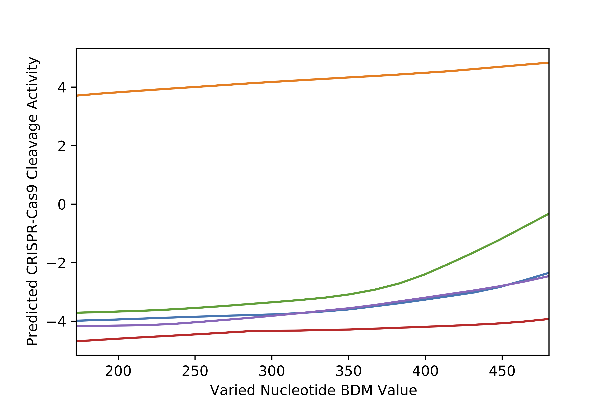
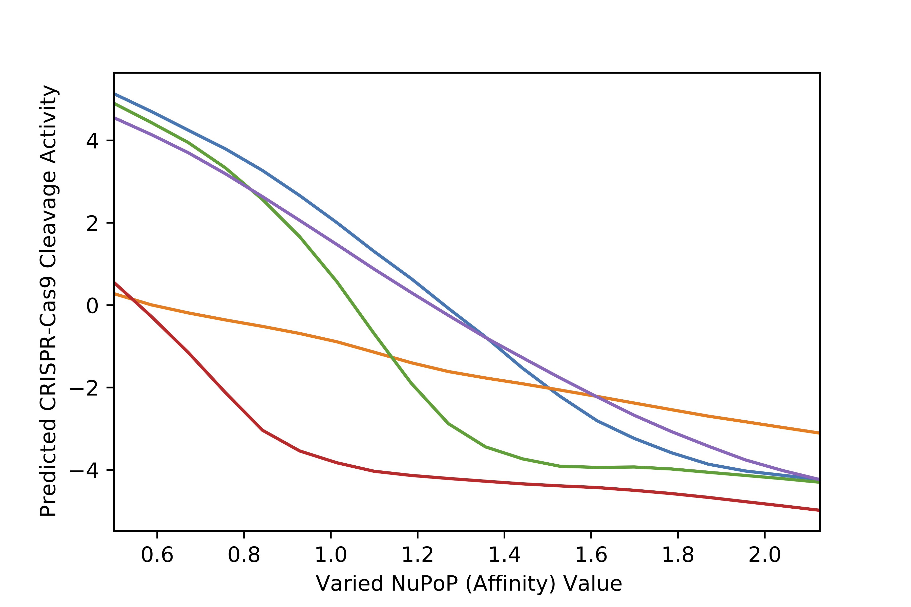
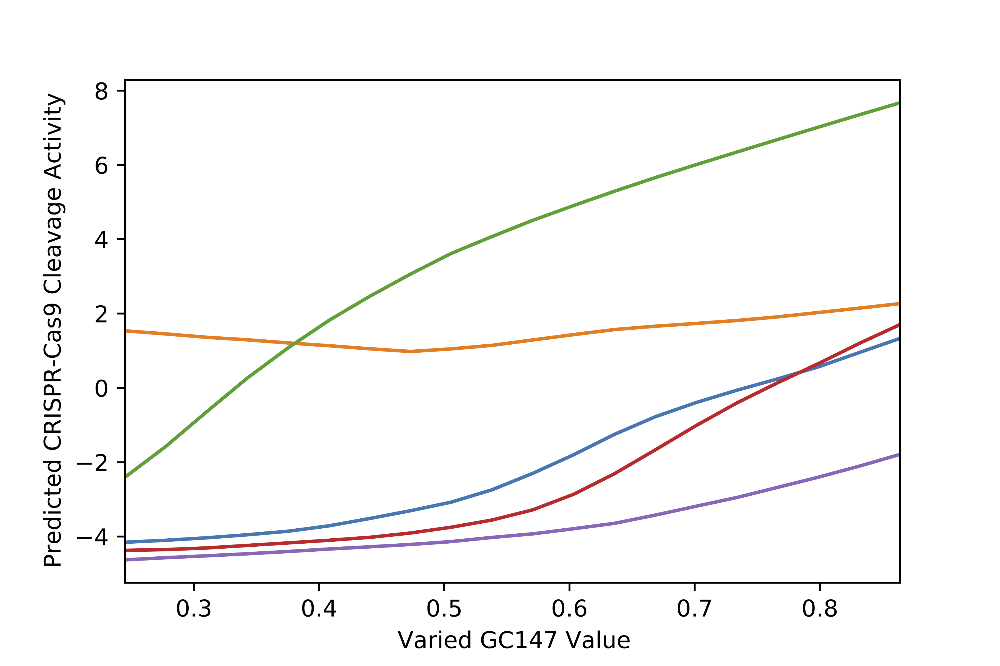
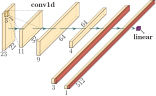

# Code accompanying "Comprehensive computational analysis of epigenetic descriptors affecting CRISPR-Cas9 off-target activity"

This Github repository contains sample Python scripts and CSV datasets for running the trained XGBoost and CNN models produced in the paper "Comprehensive computational analysis of epigenetic descriptors affecting CRISPR-Cas9 off-target activity".

The repository also contains a sample Python script for running the LeNup (H3Q85C) nucleosome occupancy predictor in the ```lenup``` folder.

Using the trained XGBoost and CNN models, we can vary the values of Nucleotide BDM, NuPoP (Affinity) and GC147, and see how such variations affect a model's CRISPR-Cas9 cleavage activity prediction. For example, using the CNN model, we can see that:

1. Increasing Nucleotide BDM increases predicted CRISPR-Cas9 cleavage
   activity value.



2. Increasing NuPoP (Affinity) decreases predicted CRISPR-Cas9 cleavage
   activity value.



3. Increasing GC147 increases predicted CRISPR-Cas9 cleavage activity value.



## Models
This repository contains the following models in the ```model``` folder:
|      File      |  Description   |
| ---------------|--------------- |
| xgb_model.json | XGBoost model. |
| cnn_model.pt   | CNN model.     |

The following shows the CNN's model architecture:


## Data
This repository contains the following CSV datasets in the ```data``` folder:

| File | Description |
| --------------|------------ |
| crisprSQL_dataset_2000.csv | Contains 2000 random experimental/augmented CRISPR-Cas9 cleavage activity datapoints from the crisprSQL dataset presented in the manuscript. |
| example_input.csv | Contains a single CRISPR-Cas9 cleavage activity datapoint from the crisprSQL dataset presented in the manuscript. |

## Sample Scripts
Sample Python scripts are available either as a self-contained Jupyter Notebook (see ```sample_scripts.ipynb```) or as individual Python scripts (listed below).

### XGBoost Model
| File  | Runnable | Description |
| -------| -------- | ------------- |
| xgb_predict_one.py | Yes | Makes a single prediction for the one CRISPR-Cas9 (off-)target cleavage activity datapoint in example_input.csv. |
| xgb_predict.py | Yes | Makes predictions for the 2000 CRISPR-Cas9 (off-)target cleavage activity datapoints in crisprSQL_dataset_2000.csv. |
| xgb_vary.py | Yes | Explores the effects of varying Nucleotide BDM, GC147 and NuPoP (Affinity) values on predicted CRISPR-Cas9 (off-)target cleavage activity. |

### CNN Model

| File | Runnable | Description |
| -------| -------- | -------------|
| cnn.py | No | Contains PyTorch code for the CNN's model architecture. The code in this file is vastly simplified from ```models.py``` in https://github.com/florianst/picrispr. |
| cnn_predict_one.py | Yes | Makes a single prediction for the one CRISPR-Cas9 off-target activity datapoint in example_input.csv. |
| cnn_predict.py | Yes | Makes predictions for the 2000 CRISPR-Cas9 (off-)target cleavage activity datapoints in crisprSQL_dataset_2000.csv. |
| cnn_vary.py | Yes | Explores the effects of varying Nucleotide BDM, GC147 and NuPoP (Affinity) values on predicted CRISPR-Cas9 (off-)target cleavage activity. |

# Requirements
```matplotlib==3.5.3 numpy==1.21.2 pandas==1.1.3 torch==1.12.1 xgboost==1.6.2```

# Contacts
jeffrey.kelvin.mak@cs.ox.ac.uk or peter.minary@cs.ox.ac.uk
